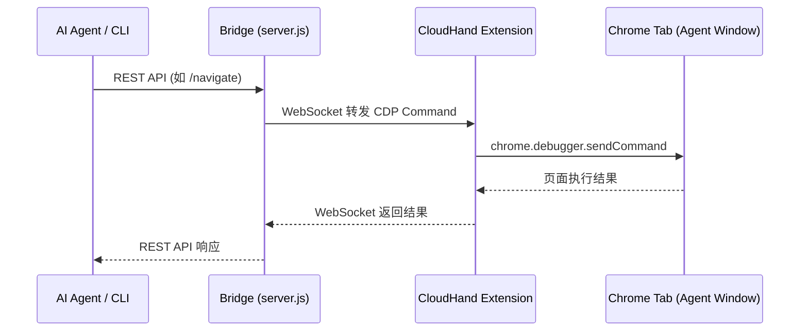

# CloudHand CDP Extension

这是 CloudHand 项目专属的 Chrome 扩展组件，用于建立 `cloudhand-bridge/server.js` 与浏览器底层间的稳定连接。

## 工作原理

1. **协议中继**：扩展通过 WebSocket 连接到本地运行的 CloudHand CDP Bridge (默认端口 `9876`)。
2. **底层操控**：利用 Chrome 原生的 `chrome.debugger` API 将标准的 CDP (Chrome DevTools Protocol) 指令透传至浏览器标签页。
3. **免打扰设计**：CloudHand 自动化操作严格限定于扩展自己打开的独立窗口中，保障用户的日常浏览不受干扰。

## 启动指南

1. **启动 Bridge 服务**
   在项目根目录下，启动本地 Bridge 服务：
   ```bash
   node cloudhand-bridge/server.js --local
   ```
   服务将监听 `127.0.0.1:9876` 端口。

2. **加载扩展**
   - 打开 Chrome，进入 `chrome://extensions`。
   - 打开右上角的“开发者模式”。
   - 点击“加载已解压的扩展程序”，并选择当前 `extension` 目录。

3. **自动连接与初始化**
   - 扩展加载完成后，会自动连接至 Bridge 服务。
   - 首次连接成功后，会自动创建一个专属的「CloudHand Agent 窗口」并建立附加（attach）。
   - 此后可通过 CLI 或 AI 直接操控该专属窗口内的页面。

## 指令透传流程


